Credit risk, fraud, seizure detection. I take a problem from raw data to a model you can question, then put it somewhere people can use it. Final-year BS Computer Science; IBM Machine Learning Professional Certificate.

[Portfolio](https://mhasaan.vercel.app/) · [LinkedIn](https://www.linkedin.com/in/muhammad-hasaan-naeem/) · [muhammadhasaan139@gmail.com](mailto:muhammadhasaan139@gmail.com)

### Live demos

Each one runs in the browser, and each is built as its own app.

  
  
  
  

Also on the site: [Nimbus](https://mhasaan.vercel.app/projects/weather) (weather), [Punchlist](https://mhasaan.vercel.app/projects/todo) (tasks), [Tally](https://mhasaan.vercel.app/projects/calculator) (calculator).

### Other work

- **[webotMCP](https://github.com/MHasaan/webotMCP)** — MCP server for the Webots robot simulator: control robots, edit scenes, read sensors and cameras from an AI assistant.
- **[kpi-nexus-final](https://github.com/MHasaan/kpi-nexus-final)** — multi-tenant KPI SaaS. NestJS, Next.js, Prisma, TimescaleDB, pgvector, BullMQ and a Python ML sidecar.
- **Seizure detection** — pose estimation that watches for seizure-like movement and alerts carers. OpenCV, MediaPipe, TensorFlow.
- **Malware detection** — parallel scanning and classification of malware signatures with Python multiprocessing.
- **[PDF_Scrapper](https://github.com/MHasaan/PDF_Scrapper)** — receipt PDFs to clean CSV.

### Tools

**Modelling** Python, SQL, PySpark, DuckDB, XGBoost, scikit-learn, PyTorch, TensorFlow, SHAP  
**Serving** FastAPI, Django, Docker, n8n  
**Web** TypeScript, React, Next.js, three.js
